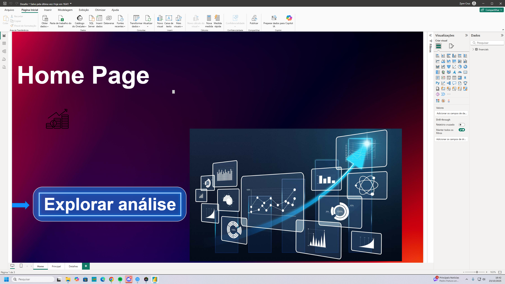
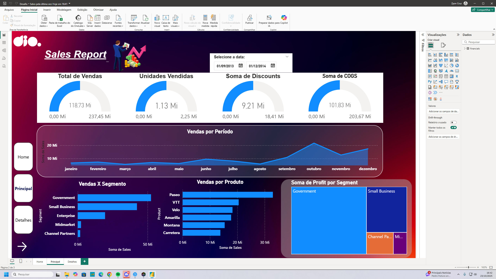
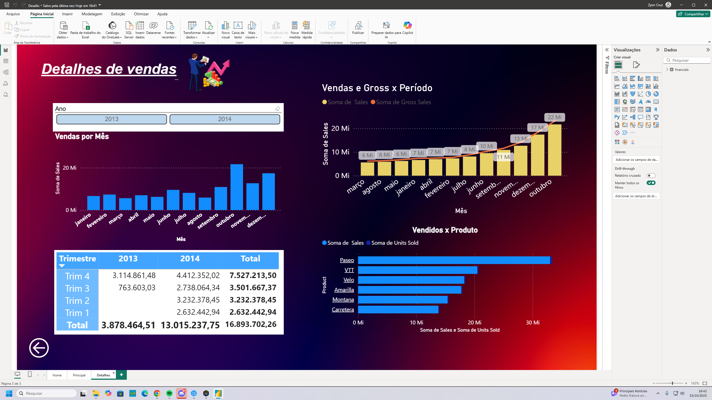

# Dashboard-de-Vendas-Criativo-com-Foco-em-UX-UI
Dashboard de Vendas Criativo com Foco em UX/UI

Este repositório contém a solução para o desafio de projeto da DIO "Criando um Relatório de Vendas com Data Analytics". O objetivo principal foi ir além do básico, focando em um design criativo ("dark mode") e em uma experiência de usuário (UX) moderna e intuitiva.

## 1. Objetivo do Desafio
O desafio consistia em criar um relatório gerencial. Decidi aplicar conceitos avançados de UI/UX para entregar um produto final com alto impacto visual, similar aos dashboards mais modernos do mercado.
O foco foi criar um relatório "dark mode" coeso, com uma paleta de cores definida (roxo, azul e amarelo) e uma navegação fluida.

## 2. Conceitos e Ferramentas Aplicadas
* **Power BI Desktop**
* **UI/UX Design:** Foco total em contraste, paleta de cores, hierarquia visual e posicionamento.
* **Imagens e Formas:** Uso de imagens de fundo e "cards" (formas de retângulo com cantos arredondados e transparência) para criar profundidade e organizar os visuais.
* **Navegação com Indicadores (Bookmarks):** Criação de um sistema de navegação completo entre as páginas usando Botões e Indicadores, simulando a experiência de um aplicativo ou site.
* **DAX (Data Analysis Expressions):** Utilizado para criar as medidas base do relatório (Soma de Vendas, Lucro, etc.) e para a criação da Dimensão `D_Calendario`.

## 3. Estrutura do Relatório
O relatório é composto por 3 páginas principais, criando uma jornada clara para o usuário:

1.  **Home Page (Capa):** Uma "splash screen" de boas-vindas que apresenta o relatório e direciona o usuário para a análise principal através de um botão interativo.
2.  **Dashboard Principal:** A página central de análise, contendo os KPIs mais importantes e os gráficos macro (Vendas por Período, Vendas por Produto, etc.).
3.  **Página de Detalhes:** Uma página de "drill-down" que permite uma análise mais granular (Vendas por Semestre, Vendas por Produto, etc.), com filtros adicionais.

## 4. Técnicas de Destaque (Design)
* **Tema "Dark Mode":** Todas as páginas utilizam um fundo escuro (gradiente roxo/azul), o que melhora o contraste e destaca as cores vibrantes dos dados.
* **"Cards" com Transparência:** Nenhum gráfico fica "flutuando". Todos estão posicionados sobre "cards" (Formas do Power BI) com cantos arredondados e um fundo escuro semi-transparente. Isso cria um visual "glassmorphism" moderno e organizado.
* **Estilização de Visuais:** Todos os gráficos tiveram seus fundos removidos e seus eixos, rótulos e títulos foram formatados com cores claras (branco, amarelo) para garantir a legibilidade no tema escuro.

## 5. Screenshots do Relatório Final
### Página 1: Home Page

### Página 2: Dashboard Principal

### Página 3: Página de Detalhes

